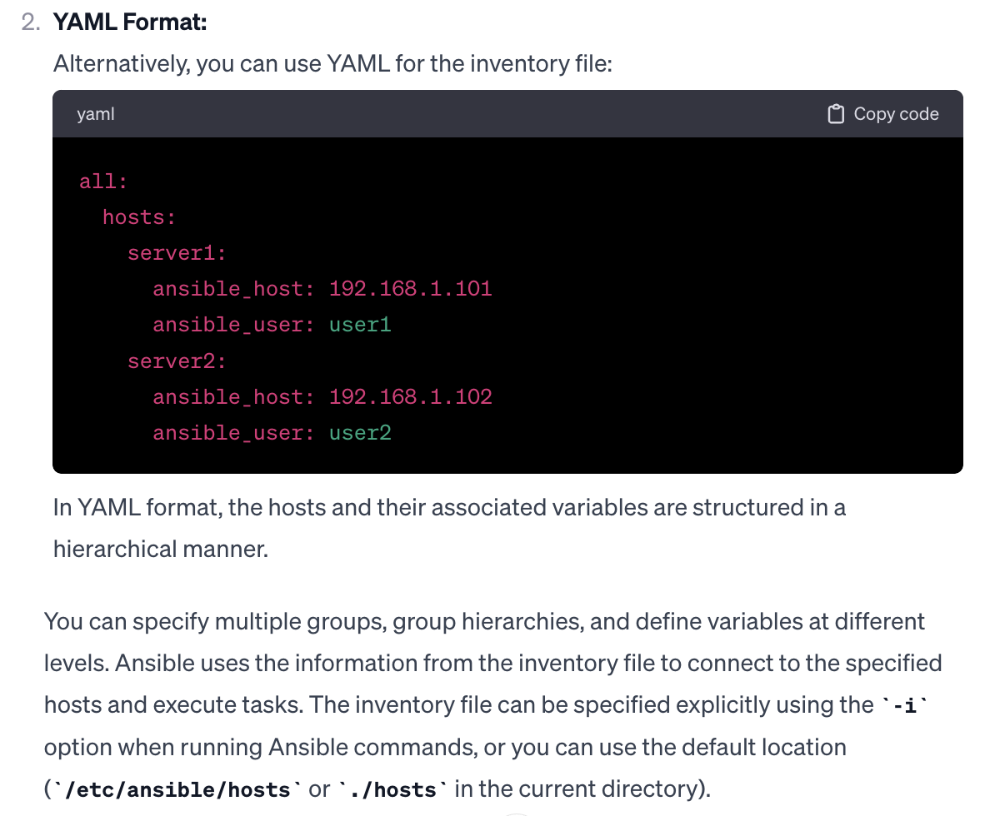
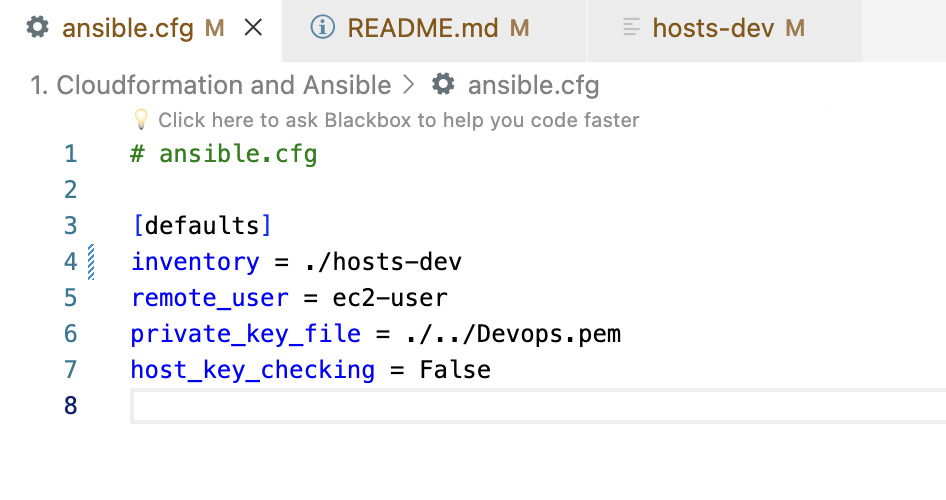
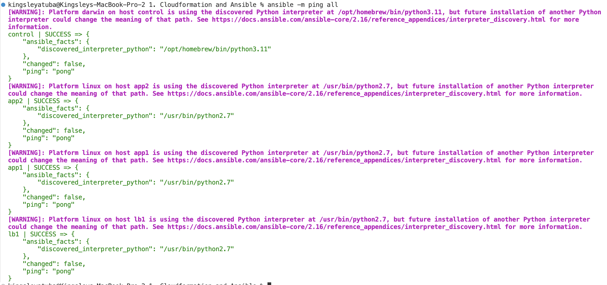
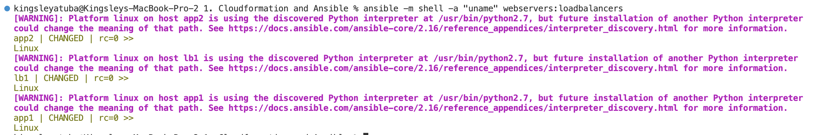

# Create-and-Configure-Cloud-Environment-with-Ansible-and-Cloudformation


## What is Ansible

Ansible is an open-source automation tool that simplifies configuration management, application deployment, and task automation through agentless, declarative playbooks written in YAML.

## What is Cloudformation

AWS CloudFormation is a service that enables users to define and provision AWS infrastructure as code (IaC) using declarative templates, allowing for automated and repeatable provisioning of resources.

## Objective

We will be using Cloudformation and Ansible to create and configure our Cloud Environment.

# Project Steps

> Step 1: Install Ansible using the codes below:

```
sudo pip install ansible
```

> Step 2: Confirm Ansible installation using the code below

```
ansible --version
```


> Step 3: Create Key Pair on AWS Console


> Step 4: Upload Template file `setup-env.yml`


> Step 5: Checkout your template file infrastructure design


> Step 6: Specify Stack Details


> Step 7: Create Stack


> Step 8: Confirm ec2 instances creation


> Step 8: Confirm elastic IP creation


## What is Ansible Inventory File




> Step 9: Create an Ansible Inventory File using the code below:

```
code hosts-dev.txt
```

and paste the code below in the file

```
# hosts-dev

[webservers]
`Server_1 IP`
`Server_2 IP`

[loadbalancers]
`LoadBalancer IP`

[local]
control ansible_connection=local
```


> Step 10: Use Ansible to list all hosts defined in your inventory file `hosts-dev`

```
ansible -i hosts-dev --list-hosts all
```


## What in is an Ansible Configuration File

An Ansible configuration file, often named ansible.cfg, allows users to centrally define default settings, such as the inventory file path and SSH configuration, for maintaining consistency across Ansible playbooks and projects.

> Step 11: Create an Ansible Configuration File in the Project home directory using the codes below:

```
code ansible.cfg
```

and paste the code below in the configuration file

```
# ansible.cfg

[defaults]
inventory = ./hosts-dev
```


> Step 12: With this configuration file, you no longer need to specify the inventory file location to list your hosts(i.e servers):

```
ansible --list-hosts all
```


> Step 13: We can target our WebServers and LoadBalancers seperately:


> Step 14: We can create aliases for our IP addresses

```
# hosts-dev

[webservers]
app1 ansible_host=54.203.202.27
app2 ansible_host=34.210.41.204

[loadbalancers]
lb1 ansible_host=52.34.47.202

[local]
control ansible_connection=local

```


> Step 14: We can list our hosts by their aliases


## What are Ansible Tasks

Ansible tasks are the individual units of work in Ansible playbooks, representing actions to be executed on remote hosts, such as installing packages, copying files, or configuring services, facilitating automation and configuration management.

> Step 15: Update your ansible.cfg:

```
# ansible.cfg

[defaults]
inventory = ./hosts-dev
remote_user = ec2-user
private_key_file = ./../Devops.pem
host_key_checking = False
```

> > inventory: Specifies the path to the inventory file, indicating that Ansible should use "/hosts-dev" as the inventory file, providing information about the managed hosts.

> > remote_user: Sets the default remote user to "ec2-user." This is the user Ansible will use when connecting to the remote hosts.

> > private_key_file: Specifies the path to the private key file for SSH authentication. In this case, it's set to "./../Devops.pem."

> > host_key_checking: This parameter is set to "False," disabling host key checking. This is useful when connecting to new hosts for the first time, as it prevents Ansible from prompting for confirmation when connecting to a host with an unknown key.



> Step 16: Log in to all virtual hosts and ping them:

```
ansible -m ping all
```



> Step 17: To retrieve and display the system information of the remote hosts:

```
ansible -m shell -a "uname" webservers:loadbalancers
```

> > -m shell: Specifies the Ansible module to use, in this case, the "shell" module, which allows you to execute shell commands on remote hosts.

> > -a "uname": Specifies the arguments to pass to the module. In this case, it's the uname command, which prints the system information of the host.

> > webservers:loadbalancers: Specifies the target hosts by using inventory groups. Ansible will execute the command on all hosts belonging to the "webservers" and "loadbalancers" groups.



## What are Ansible Modules

Ansible modules are reusable, standalone scripts that perform specific tasks on remote hosts, allowing automation of various operations such as system administration, configuration management, and application deployment.

Here are a few examples of Ansible modules in action:

> Shell Module:

- Execute a shell command on remote hosts.
- ansible -m shell -a "ls -l" webservers

> Copy Module:

- Copy a file from the local machine to remote hosts.
- ansible -m copy -a "src=/path/to/local/file.txt dest=/remote/path/" webservers

> Service Module:

- Ensure a service is running on remote hosts.
- ansible -m service -a "name=apache2 state=started" webservers

> Package Module:

- Ensure a package is installed on remote hosts.
- ansible -m package -a "name=nginx state=present" webservers

> User Module:

- Create a user on remote hosts.
- ansible -m user -a "name=johndoe password=<encrypted_password>" webservers

> File Module:

- Ensure a file exists or absent on remote hosts.
- ansible -m file -a "path=/path/to/file state=present" webservers
